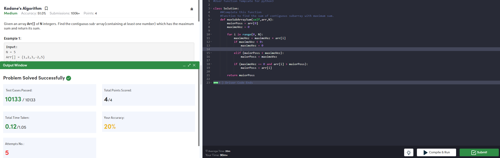
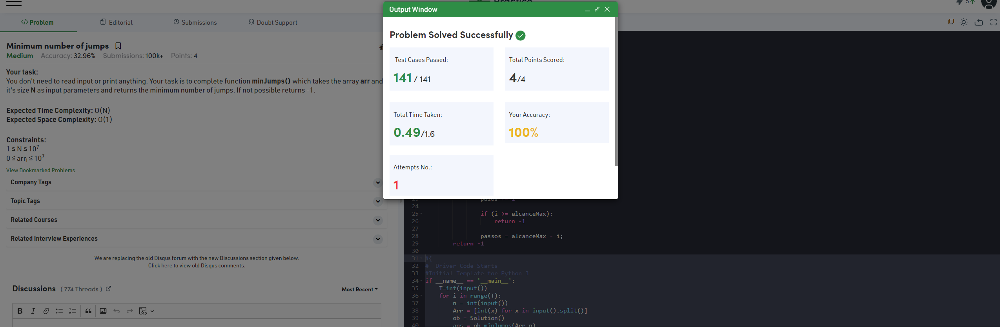
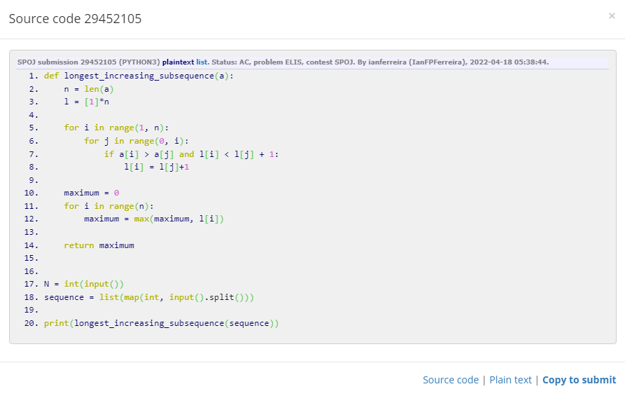
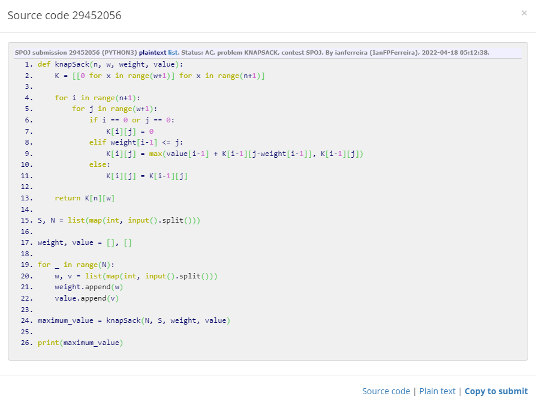

# D-C_Dupla17

**Número da Lista**: 5<br>
**Conteúdo da Disciplina**: Programação Dinâmica<br>

## Alunos
|Matrícula | Aluno |
| -- | -- |
| 18/0096991  |  Álvaro Leles Guimarães |
| 18/0102087  |  Ian Fillipe Pontes Ferreira |

## Sobre 
Esse projeto tem como objetivo mostrar a solução de problemas de programação competitiva utilizando a estratégia de programação dinâmica. Para isso resolvemos 4 problemas pertencentes a 2 juízes onlines diferentes:

- SPOJ
- CodeForces

O funcionamento do projeto se dá com a execução de cada arquivo, passando como valores de entrada os exemplos de cada problema, que se encontra nos links que há dentro de cada arquivo.py neste repositório.

## Screenshots

| | |
:---------: | :------: |
| Accepted do GeeksforGeeks | Accepted do GeeksforGeeks |
|  |  |
| Accepted do SPOJ | Accepted do SPOJ |
|  |  |

## Instalação 
**Linguagem**: Python<br>
**Pré-requisitos**: Para rodar o projeto é necessário ter o Python instalado na versão 3.8.5, que foi a versão utilizada, ou uma versão superior. Acesse <a href="https://www.python.org" target="_blank">aqui</a> para instalar o Python.

### **1. Clonar o repositório:**

```cmd
git clone https://github.com/projeto-de-algoritmos/PD_Dupla17.git
```

### **2. Executar os códigos:**

Com o python instalado execute um dos comandos a seguir estando com o terminal na pasta raiz do repositório.

- Windows:

```
python ELIS.py
```

```
python KadanesAlgorithm.py
```

```
python KNAPSACK.py
```

```
python MinimumNumberJumps.py
```

- Linux

```
python3 ELIS.py
```

```
python3 KadanesAlgorithm.py
```

```
python3 KNAPSACK.py
```

```
python3 MinimumNumberJumps.py
```

## Outros

### ELIS.py

Este problema do SPOJ simula o problema da maior subsequência crescente, nesse sentido, utilizamos a estratégia de programação dinâmica para resolver esse problema dividindo o problema original em subproblemas, na qual vamos atualizando em uma lista o valor da subsequência, e depois fazemos um laço de repetição para encontrar a maior subsequência.

### KadanesAlgorithm.py

Neste problema, é dado um array de N inteiros, e deve-se encontrar um sub-array que possua a maior soma. E pra resolver esse problema, utiliza-se programação dinâmica onde cada iteração tem duas opções: ou pegar o elemento da vez e continuar com a soma anterior OU reiniciar e selecionar um novo sub-array.


### KNAPSACK.py

Este problema do SPOJ simula o famoso problema da mochila, na qual nós temos que selecionar os itens mais valiosos para colocar em uma mochila que possui uma carga máxima, nesse sentido, utilizamos uma estratégia de programação dinâmica ao dividir o problema em subproblemas e ir escalando-o até resolver o problema geral, logo, nós criamos uma matriz com 'n' linhas, que seria a quantidade de itens, e 'w' colunas, que seria o peso máximo da mochila, e com isso resolvemos o problema para mochilas menores até atingir a carga máxima, e por fim, retornamos o valor que se encontra na posição K[n][w] que seria o valor máximo que poderia ser carregado na mochila.

### MinimumNumberJumps.py

Dado um array com N inteiros, onde cada elemento representa o maior número de passo que pode ser dado a partir daquele elemento, deve-se encontrar o menor número de pulos para chegar ao final do array. Usa-se a programação dinâmica nesse problema já que a cada elemento deve-se analizar se ele deve ser pegado ou não, e se essa combinação alcança o final do array.